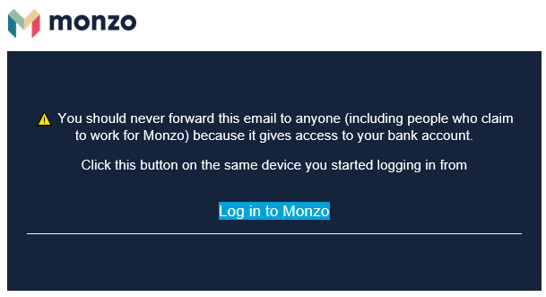
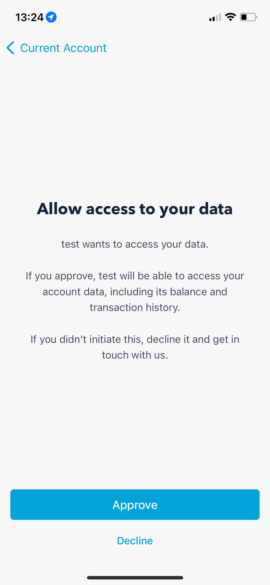

Generating An Access Token
=====================================

If you have followed along with the tutorials you will already have access to a
Client ID, Owner ID and a Client Secret. Although these help us access the Monzo
API they are not actually credentials that will work when querying the API,
rather they give us the ability to get the tokens we can use.

Obtaining An Access Token
-------------------------------------

Converting our Client ID and Client Secret to an access token is a two step process,
the first step will feel familiar, it is similar to the process used to obtain
access to the developer area.

Creating A Request URL
^^^^^^^^^^^^^^^^^^^^^^^^^^^^^^^^^^^^^

Our first step is that we need to generate a URL that you can use to approve API
access. Luckily we have thought of that and have a method to do this.

The code I am going to use here is available in the examples folder as
auth_step_01.py.

.. literalinclude:: ../../examples/auth_step_01.py
   :language: python

In the above code you need to assign the Client ID and Client Secret and then
execute the script. This will output a URL similar to:

https://auth.monzo.com?client_id=oauth2client_REDACTEDredirect_uri=http://127.0.0.1/monzo&response_type=code&state=e7aF6mtU6MFNovkxUGfCsic6Kt7GUClBQWi0KkZY1YJuULK2QVEEujcfkLnF2Jxh

So that we know what is going on here, lets break this URL down a bit:

**Monzo Authentication URL**

Value: https://auth.monzo.com

Description: This is the URl Monzo uses for authentication

**Client ID**

Value: oauth2client_REDACTED

Description: This will match the Client ID that you received from Monzo when creating a client
and entered into the above script.

**redirect_uri**

Value: http://127.0.0.1/monzo

Description: As you will see shortly the authentication process redirects you to
a URL, this is the URL it will redirect too (more on this later). This must match
the URl you entered when creating the client in the Monzo developer site. If you
need to change this you can login and edit the client.

**response_type**

Value: code

Description: This dictates the type of authentication that the API will use, Monzo
only support code.

**state**

Value: e7aF6mtU6MFNovkxUGfCsic6Kt7GUClBQWi0KkZY1YJuULK2QVEEujcfkLnF2Jxh

Description: This is a random string that is intended to ensure when Monzo redirects
you that the request is valid. This is created automatically therefore you can
ignore this.

Authenticating The API
^^^^^^^^^^^^^^^^^^^^^^^^^^^^^^^^^^^^^

Now that we have the URL you can safely click on it. The process here will look
familiar:

.. image:: images/api_authorize_login.png
   :width: 400
   :alt: Monzo Authorization Login

This will look identical to a page we visited when creating the client (the developer
site uses the API just as we are). There is one thing to note, in the summary at the
top it specifies the name of the client that you are granting access.

Once you are happy click on the "Continue To Login" button, enter your email address and
click on the "Submit" button.

You will now receive an email similar to the following:

Click on "Log In To Monzo". Once your browser opens you will likely find that you go
to a page that does not exist (the redirect URL that you specified above) but with
some extra parameters. Take a copy of the URL in your browser.

Lets take a closer look at the URL:

**Redirect URL**

Value: https://127.0.0.1/monzo

Description: This is the redirect URL that was specified when creating the client
and entered in the script when creating the URL.

**code**

Value: REDACTED

Description: This is an authorization code that our script can use to obtain an
access token. I have redacted the value, this should be kept private.

**state**

Value: e7aF6mtU6MFNovkxUGfCsic6Kt7GUClBQWi0KkZY1YJuULK2QVEEujcfkLnF2Jxh

Description: This will match the random string that we saw in the URL that you
clicked on a moment ago, this is a single use token and proves the redirect URL was in
response to your request to authorise.

Retrieving An Access Token
^^^^^^^^^^^^^^^^^^^^^^^^^^^^^^^^^^^^^

We are almost there. We have all the details we need to create an access token.
As you would expect, we have an example for that:

.. literalinclude:: ../../examples/auth_step_02.py
   :language: python

As you can see from the code above, there is a number of variables we need to
populate:

- client_id: The Client ID we obtained from the Monzo developer area
- client_secret: The Client Secret we obtained from the Monzo developer area
- redirect_uri: The redirect URL we entered into the Monzo developer area
- state: This is the random string that we created in step one and should match the state value in the response
- code: The authorisation code in the redirected URL

Once you have populated these you can execute the python script. This will result
in three print statements outputting text such as:

- access_token = 'REDACTED'
- expiry = 1632680343
- refresh_token = 'REDACTED'

You should take a copy of these values as you will need them for any API call.

Just a quick note on what these are:

**access_token**

This is the token that is used to make any API calls.

**expiry**

When creating an access token, to limit any damage that can be done from this being
exposed, it has a limited lifespan before it expires. This lifetime is dictated
in seconds.

To make things easier this package converts it into the unix timestamp that the
token will expire.

**refresh_token**

If you specified "Confidential" when creating the client in the Monzo developer
area then you will have received a refresh token. This token can be used to generate
a new access token without following this complete process again.

This does not extend the life of the token, instead a new token is created with a
new expiry.

There is one further step that we need to take. Although the access token can be
used to authenticate for your account and can login to the API, it is not currently
authorised to carry out any requests. After using the second example your Monzo
app will have triggered an alert.

Open the Monzo app and you will see something like:

Click on "Approve"

Congratulations, you now have credentials that you can use to query the API.
