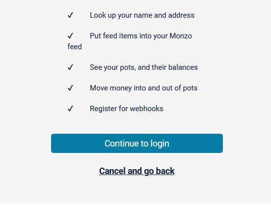
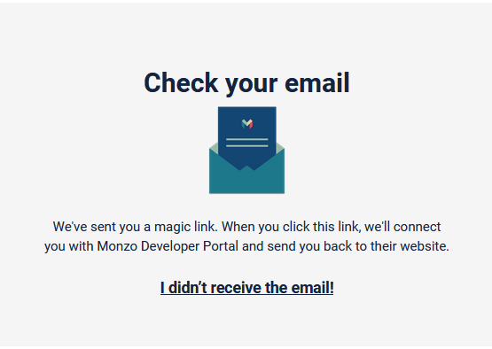
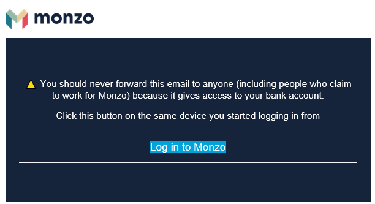
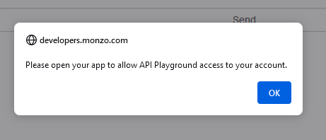
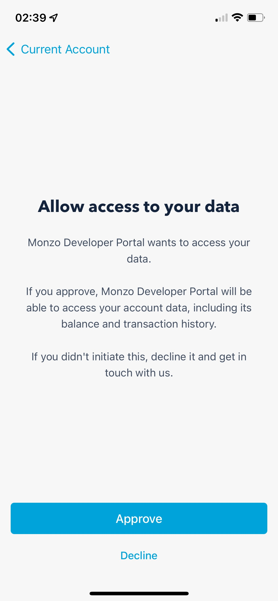
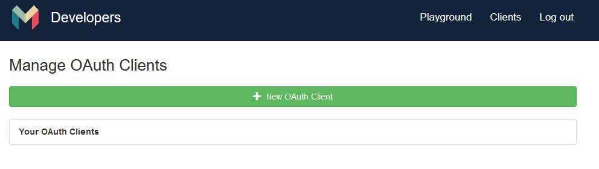
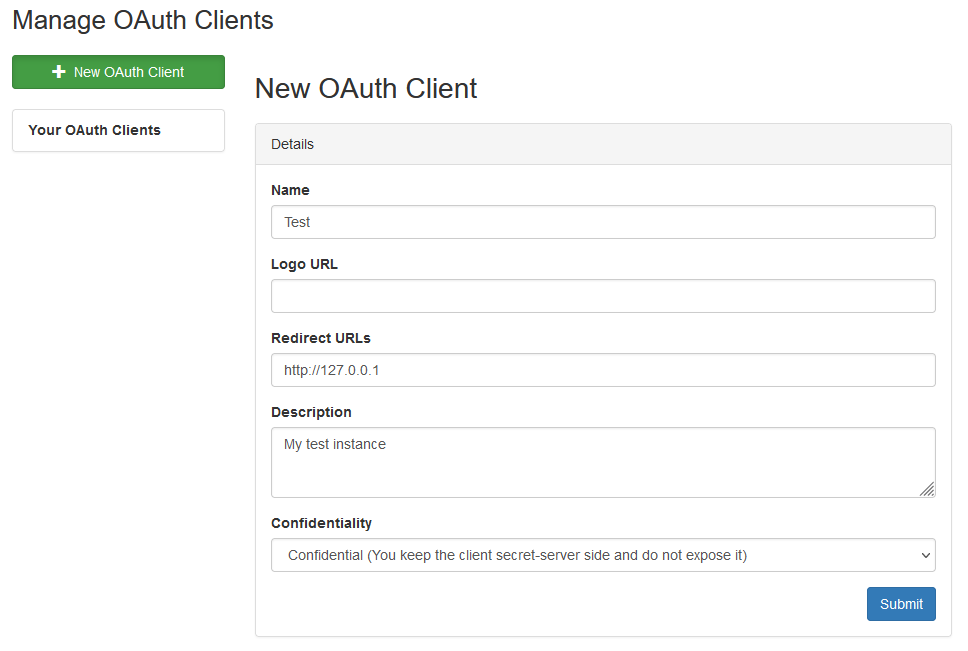
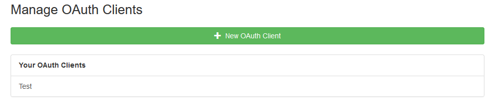
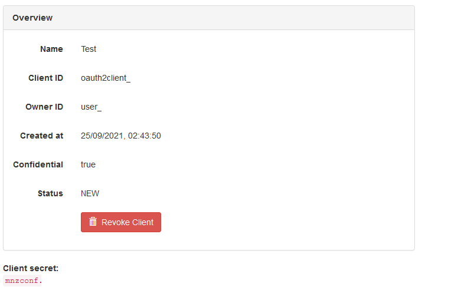

Monzo Setup
=====================================

As with any restricted resource on the internet, you require credentials to login.
The Monzo APi is no different.

The following tutorial will guide you through creating credentials for your account.

Logging In
-------------------------------------

To start with we have to log into the Monzo developer system, this can be found
at `https://developers.monzo.com/ <https://developers.monzo.com/>`_.

On visiting this page you will find a "Sign in with your Monzo Account"

.. image:: images/sign-in-1.png
  :width: 400
  :alt: Monzo sign in step one

Once you have clicked on this link you will be presented with another page
inviting you to log in. On this page click on "Continue to login"

You will now be asked to enter your email address, you need to enter the email
address associated with your account. Once entered click "Submit" and you will be
presented with the following page:

It is now time to check your email, you should have received an email containing:

You should click on the "Log Into Monzo" link. This will now take you back to
https://developers.monzo.com but you will now be logged in. HOWEVER you wil
receive an alert on screen similar to the following:

Although we have successfully logged in, we have not authorised the token this
processed to have full access to your account. To complete authorisation we
now need to go to the Monzo app where you will find an alert, clicking on the alert
will display a message such as the following:

To be able to use the developer interface properly you will need to select approve.

You have now successfully logged into the Monzo developer forum and granted
the relevant permissions. We can now move onto creating an API client.

Creating A Client
-------------------------------------

Now that we are fully logged in we can create the API client. To start with click
the client link in the top right hand side. You should now see a list of existing
clients, albeit it an empty list.

To get started you can click on "+ New OAuth Client". This will open a form
allowing us to create a new client.

As you can see there are a number of fields that we can enter details into.

**Name**

You can enter any name here, it would be best to give it a name that identifies
the project it is being used on as you can have multiple clients.

**Logo URL**

This can e left blank

**Redirect URL's**

The redirect URL's are used during the authorisation phase of using the API. You
will need to have a webserver listening on the address to capture the get
parameters (we can work around this if you dont have one).

**Description**

You can enter any description here.

**Confidentiality**

Unless you are only going to utilise the API for a quick task you should select
"Confidential", this will allow a refresh token to be provided. Under normal
circumstances a token will expire, a refresh token will allow access to be renewed.

Now that we have completed the form you can click "Submit". Once submitted you
will be presented with a client list again, this time however there will be one
entry:

If you now click on the new entry you will be presented with details such as:

From this page we need to take three pieces of information (the values in the above
screenshot has been redacted, make sure you also keep yours secret):

- Client ID
- Owner ID
- Client Secret

You have now successfully created an OAuth client that you can use with the
API. Keep the above details handy and you can now go and look at some of the
other tutorials.
